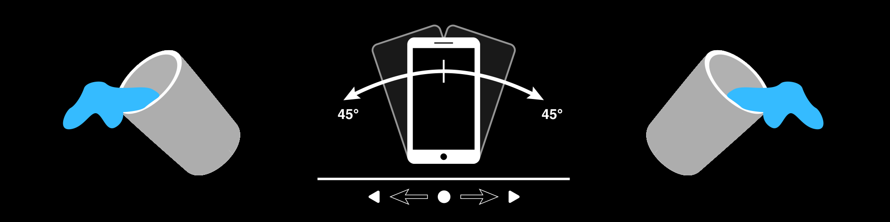
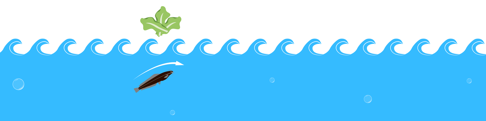

# project3: How did I get on your plate?

## Concept of navigating
Let the user go through the water-cycle/life-cycle of their food, 
by using the orientation of a mobile device. 

### Source
`Water-cycle > water flow > direction > device orientation`

### Zero-state

`In order to navigate, you have to tilt the appliance a small amount to the left or right. Max 45&deg; to the left or right.

Keep it in the same position until the page has been changed. Return the device orientation back to it's original state to stop the page from changing.`

